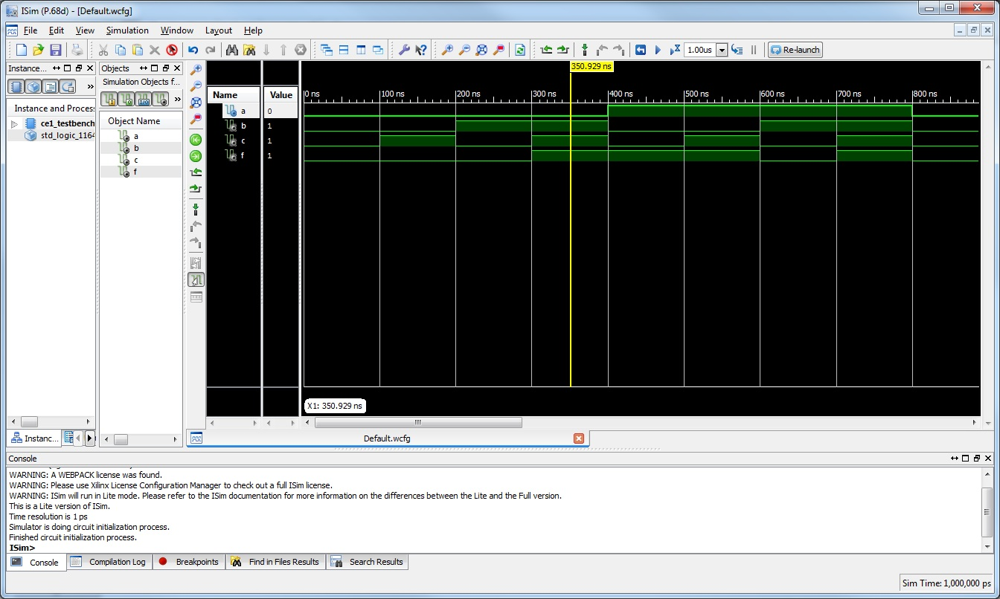

# Git In-Class Exercise

TThis is the first computer exercise.  

## The Basic Idea

The project is an implementation of a simple logic circuit.  The idea is to test our ability to
implement and compile a VHDL design.  

## Files Included

- CE1_shell.vhd:  the VHDL file with the implementation
- CE1_testbench.vhd:  VHDL test bench to test the implementation
- testbenchoutput.jpg:  Screen shot of the test. 

